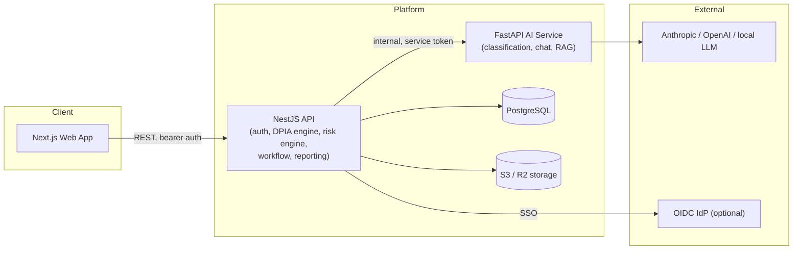

# Shieldwise — AI-Powered Privacy Engineering Platform

<p>
  
  
  
  
  
  
  
</p>

**Shieldwise turns Data Protection Impact Assessments from a compliance chore into
an intelligent, continuous privacy decision engine.** It automates the full
UK GDPR Article 35 lifecycle — screening, adaptive questionnaires, automated
risk scoring, control recommendation, multi-framework compliance mapping,
approval workflow, and regulator-ready reporting — for governments, financial
institutions, healthcare organisations, and multinational enterprises.

**New here? [`HOWTO.md`](HOWTO.md) is a 10-minute read covering what the
platform aims to achieve and how to drive it end-to-end.**

This is not a document generator. Shieldwise is a privacy engineering platform:
an AI assistant grounded in real GDPR/ICO guidance, a rule-based risk engine
that scores likelihood × impact × sensitivity against your actual answers and
data-flow model, and a compliance mapping layer that turns "we did a DPIA"
into "here is our coverage against ISO 27001, NIST CSF 2.0, and SOC 2, with
the gaps ranked."

---

## Example: biometric access control DPIA

Portfolio sample for a **facial-recognition office access** system (Article 9
biometric data):

1. **Screening** — processing special category biometric data for unique
   identification → DPIA **REQUIRED** under Article 35 / ICO screening.
2. **Questionnaire** — purpose (reduce tailgating), necessity (badge/PIN
   failure modes), Article 9 condition, people in scope (~1,200 staff/
   contractors), templates held by a UK processor.
3. **Risks** — biometric identification remains **HIGH** residual after
   encryption, least privilege, and template protection; function-creep and
   template-compromise risks mitigated to **MEDIUM**.
4. **Article 36** — prior consultation with the ICO is **flagged** because
   residual risk is still HIGH.
5. **Export** — completed Word document checked into the repo so visitors
   can inspect output without running the stack:

**[`sample_outputs/example_dpia.docx`](sample_outputs/example_dpia.docx)**

Full plain-English guidance: [`docs/DPIA_GUIDE.md`](docs/DPIA_GUIDE.md).

---

## Why Shieldwise exists

Most DPIA tooling is a Word template with a SharePoint approval chain. That
doesn't scale past a handful of assessments a year, produces inconsistent
risk judgements between assessors, and gives DPOs no visibility into
organisation-wide privacy posture. Shieldwise treats privacy risk the way mature
organisations treat security risk: as a continuously monitored, systematically
scored, control-mapped programme — not a point-in-time document.

## Core capabilities

| Capability                                      | What it does                                                                                                                                                                                                                                                          |
| ----------------------------------------------- | --------------------------------------------------------------------------------------------------------------------------------------------------------------------------------------------------------------------------------------------------------------------- |
| **Adaptive questionnaire**                      | Skip-logic and automatic follow-ups driven by a declarative condition DSL — answering "processes health data" reveals special-category follow-ups; the same engine renders the UI and drives the risk rules.                                                          |
| **AI processing classification**                | Describe a processing activity in plain language; Claude determines data categories, special category status, children's data, AI/automated-decision involvement, and screens against the ICO's DPIA-required checklist — with cited legal rationale.                 |
| **Automated risk engine**                       | 20+ built-in rules (special category processing, large-scale processing, cross-border transfers, automated decision-making, weak access control, …) score inherent and residual risk, factoring in implemented controls. Fully configurable thresholds and modifiers. |
| **Control recommendation & compliance mapping** | Every risk links to recommended controls; every control maps to UK GDPR, EU GDPR, ISO 27001, ISO 27701, NIST CSF 2.0, NIST Privacy Framework, CIS v8, OWASP ASVS 4, SOC 2, PCI DSS 4, and HIPAA. Per-framework coverage dashboards surface gaps.                      |
| **Data flow modeller**                          | Drag-and-drop system/API/database/vendor diagram with automatic detection of cross-border transfers, third-party processors, unencrypted flows, and trust-boundary crossings — feeding directly into the risk engine.                                                 |
| **Privacy assistant**                           | RAG-grounded chat over curated UK GDPR/ICO guidance; drafts and improves questionnaire answers in place; generates executive summaries.                                                                                                                               |
| **Workflow & audit**                            | Configurable approval workflow (draft → review → legal/security review → DPO/executive approval → monitoring → periodic review) with an immutable, append-only audit trail.                                                                                           |
| **Reporting**                                   | PDF, DOCX, HTML, Markdown, CSV, and JSON exports, with templates for board reports, ICO-ready submissions, and executive summaries.                                                                                                                                   |
| **Enterprise auth**                             | Password + TOTP MFA, WebAuthn passkeys, OIDC SSO (Keycloak, Entra ID, Okta, Google), personal API tokens, full audit logging.                                                                                                                                         |

## Screenshots

Product UI screenshots used on the landing page:

| Surface | Asset |
| ------- | ----- |
| Dashboard | [`apps/web/public/dashboard.png`](apps/web/public/dashboard.png) |
| Questionnaire | [`apps/web/public/dpia-questionaire.png`](apps/web/public/dpia-questionaire.png) |
| Risks | [`apps/web/public/dpia-risks.png`](apps/web/public/dpia-risks.png) |
| DPIA list | [`apps/web/public/dpia-list.png`](apps/web/public/dpia-list.png) |
| Data flow | [`apps/web/public/dpia-dataflow.png`](apps/web/public/dpia-dataflow.png) |

## Architecture



Three services, one shared type layer:

- **`apps/web`** — Next.js 15 (App Router), TypeScript, Tailwind, React Query.
- **`apps/api`** — NestJS modular monolith: auth, organisations, DPIAs, risk
  engine, controls, evidence, analytics, reporting, audit.
- **`apps/ai`** — FastAPI microservice: classification, chat assistant,
  RAG over UK GDPR/ICO guidance, provider-agnostic (Anthropic/OpenAI/local).
- **`packages/shared`** — Zod schemas, enums, the adaptive-questionnaire
  condition DSL, and the workflow state machine — the single source of truth
  consumed by both the API and the web app.

See [`docs/architecture/system-architecture.md`](docs/architecture/system-architecture.md)
for the full write-up, [`docs/architecture/database.md`](docs/architecture/database.md)
for the data model, and [`docs/architecture/deployment.md`](docs/architecture/deployment.md)
for deployment topology.

## Technology stack

**Frontend:** Next.js 15, React 19, TypeScript, TailwindCSS, React Query, React Hook Form, Zod, Framer Motion, Recharts
**Backend:** NestJS 10, FastAPI, PostgreSQL 16, Prisma
**AI:** Anthropic Claude (default), OpenAI-compatible fallback, BM25 RAG
**Auth:** Argon2id, TOTP, WebAuthn, optional OIDC, JWT + refresh-token rotation
**Infra:** Docker Compose (local), GitHub Actions; deploy to any container host + managed Postgres
**Storage:** S3-compatible (MinIO local / Cloudflare R2 or S3 in production)
**Security tooling:** CodeQL, Gitleaks, Trivy, cosign, pnpm audit / pip-audit

## Quick start

The fastest path is Docker Compose — one command brings up the whole stack:

```bash
git clone https://github.com/Abosede-o-Makinde/dpia-generator.git && cd dpia-generator
cp .env.example .env
# JWT_ACCESS_SECRET and JWT_REFRESH_SECRET must be ≥16 chars — the
# placeholders in .env.example are not: generate real ones, e.g.
#   openssl rand -base64 48
# and paste the output into each field.

pnpm run compose:up --build
docker compose -f infra/compose/docker-compose.yml exec api \
  sh -c "cd /repo/apps/api && node_modules/.bin/prisma migrate deploy"
docker compose -f infra/compose/docker-compose.yml exec -e SEED_DEMO=true api \
  sh -c "cd /repo/apps/api && node_modules/.bin/ts-node --transpile-only prisma/seed.ts"
```

Open **http://localhost:3000** and sign in with the seeded demo account:
`dpo@demo.shieldwise.local` / `Demo-Passw0rd-Shieldwise!` (dev/demo data only — never
used in production seeds).

Full walkthrough (including the hot-reload dev-mode alternative, AI provider
configuration, and troubleshooting) — see
[`docs/guides/local-deployment.md`](docs/guides/local-deployment.md).

## Documentation

| Document                                                             | Covers                                                         |
| -------------------------------------------------------------------- | -------------------------------------------------------------- |
| [DPIA Guide](docs/DPIA_GUIDE.md)                                     | When a DPIA is required, Article 36, how to run one here       |
| [Product Requirements](docs/product-requirements.md)                 | Personas, functional/non-functional requirements, roadmap      |
| [System Architecture](docs/architecture/system-architecture.md)      | Service boundaries, request flows, tenancy model               |
| [Database Design](docs/architecture/database.md)                     | ER diagram, table reference, indexing, multi-tenant isolation  |
| [Local Deployment Guide](docs/guides/local-deployment.md)            | Tested, step-by-step: Docker Compose and manual dev mode       |
| [Deployment Guide](docs/architecture/deployment.md)                  | Docker Compose, hosted deploy (e.g. Render + Vercel), environment matrix |
| [Threat Model](docs/security/threat-model.md)                        | STRIDE analysis, trust boundaries, mitigations                 |
| [Privacy Model](docs/security/privacy-model.md)                      | How Shieldwise applies GDPR-by-design to its own processing         |
| [Compliance Framework Mapping](docs/compliance/framework-mapping.md) | Control-to-framework mapping methodology and coverage          |
| [Architecture Decision Records](docs/adr/)                           | Why key technical decisions were made                          |
| [User Guide](docs/guides/user-guide.md)                              | Running a DPIA end-to-end as a DPO/privacy engineer            |
| [Administrator Guide](docs/guides/administrator-guide.md)            | Org setup, SSO, roles                                      |
| [Developer Guide](docs/guides/developer-guide.md)                    | Local setup, testing, contribution workflow                    |

## Security

Please report vulnerabilities per [`SECURITY.md`](SECURITY.md) — do not open
a public issue. The platform ships with OWASP ASVS L2-aligned controls;
see the [threat model](docs/security/threat-model.md) for the full analysis.

## Contributing

See [`CONTRIBUTING.md`](CONTRIBUTING.md). Privacy-domain content (risk rules,
control mappings, the DPIA questionnaire) has an additional review bar — every
rule must cite its legal or guidance source.

## Licence

Apache License 2.0 — see [`LICENSE`](LICENSE).
