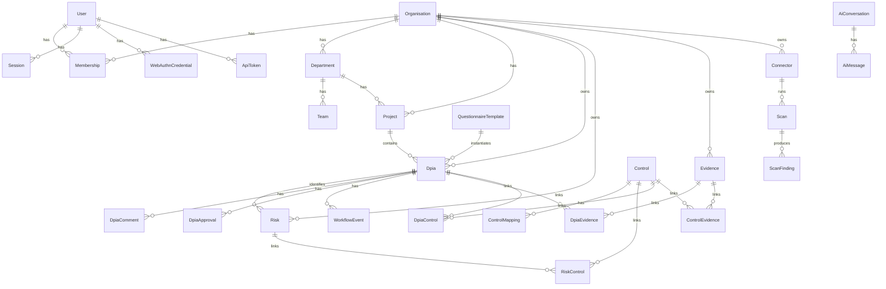

# Database Design

PostgreSQL 16, managed through Prisma (`apps/api/prisma/schema.prisma`).
The AI service uses in-process BM25 retrieval (no vector columns in the
application schema).

## Entity relationship diagram

## Design decisions

**Soft deletes on user-facing aggregates** (`deletedAt` on Organisation,
Department, Project, User, Dpia, Risk, Control, Evidence, Connector,
AiConversation, DpiaComment) — deletion in a compliance product must be
recoverable and auditable; a DPIA "deleted" in error should not be
unrecoverable. Append-only tables (`AuditLog`, `WorkflowEvent`) have no
delete path at all, enforced by the Prisma extension.

**`AuditLog.organisationId` and `actorId` are nullable** — system-level
events (failed login before a user is resolved, seed operations) legitimately
have no tenant or actor. The alternative (a synthetic "system" org/user)
was rejected as it would pollute per-org audit queries with cross-tenant
noise.

**`Risk.ruleKey` distinguishes automated from manual risks** — auto-generated
risks are fully replaced on every `evaluateRiskRules()` run (stale rows with
a `ruleKey` are deleted and re-inserted); manually created risks (`ruleKey =
null`) are never touched by the engine. This lets a security reviewer add a
bespoke risk the rule engine can't express, without it disappearing on the
next automated re-assessment.

**`Control.organisationId` is nullable** — global (built-in) controls have
`organisationId = null` and are visible to every tenant; org-authored custom
controls carry their owning `organisationId`. The Postgres RLS policy for
`controls` is the one exception to strict tenant isolation, explicitly
allowing `organisationId IS NULL OR organisationId = current_org`.

**`ControlMapping` is a separate table, not a JSON column on `Control`** —
compliance queries need to filter/aggregate by `(framework, reference)`
efficiently (e.g. "every control mapped to ISO 27001"), which a JSON blob
would require deserializing per row to answer. The unique constraint
`(controlId, framework, reference)` also prevents duplicate mappings.

**`DpiaControl` vs `RiskControl`** — a control can be tracked at the DPIA
level (overall implementation status for this assessment) independently of
its per-risk linkage (which risks it mitigates, and at what effectiveness).
Collapsing these into one table would force every DPIA-level control
adoption to also specify a risk, which isn't always meaningful (e.g. "we
adopted MFA org-wide" isn't tied to one specific risk).

## Indexing strategy

Every tenant-scoped table is indexed on `organisationId` (or, where a table
hangs off a DPIA, on `dpiaId` — itself org-scoped) as the leading column,
since every query is tenant-filtered first. Composite indexes then cover the
dashboard's hot paths: `Dpia(organisationId, status)`,
`Dpia(organisationId, updatedAt)`, `Risk(organisationId, level)`,
`AuditLog(organisationId, createdAt)`, `WorkflowEvent(dpiaId, createdAt)`.

## Multi-tenant isolation (three layers)

1. **Application** — every service method takes an explicit `orgId`.
2. **ORM** — the Prisma client extension (`prisma.service.ts`) injects
   `organisationId` into every query against a tenant-scoped model,
   read from request-scoped `AsyncLocalStorage`; cross-tenant unique-key
   lookups (`findUnique`, `update`, `delete`) are checked for ownership
   before the operation proceeds, returning 404 rather than leaking
   existence.
3. **Database** — `apps/api/prisma/rls.sql` defines Postgres Row-Level
   Security policies keyed on `current_setting('app.current_org')`, enforced
   for the `shieldwise_app` role regardless of application-layer bugs. The
   `audit_logs` and `workflow_events` tables additionally have `UPDATE`/
   `DELETE` revoked from that role at the grant level — not just policy —
   so even a compromised application cannot rewrite history.

## Migrations

Prisma migrations live in `apps/api/prisma/migrations/` (generated via
`prisma migrate dev` locally, applied in CI/production via
`prisma migrate deploy`). Apply `rls.sql` once per environment after the
first migration — it is idempotent (`DROP POLICY IF EXISTS` /
`CREATE POLICY`) so safe to re-run after schema changes that add new
tenant-scoped tables.
