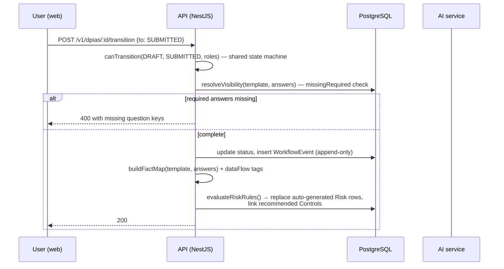
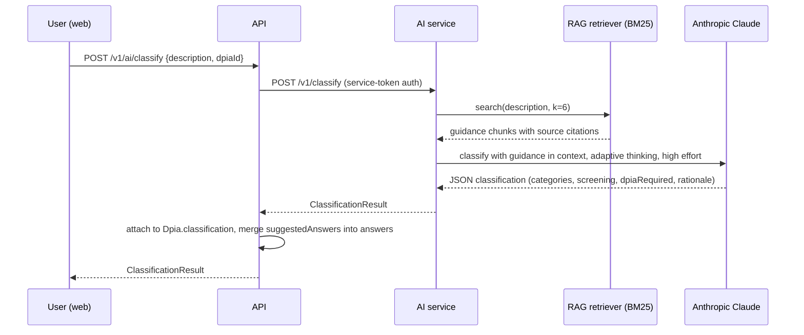

# System Architecture

## Overview

Shieldwise is a three-service application sharing one type-safe contract layer:

```
apps/
  web/      Next.js 15 — browser-facing SPA/SSR frontend
  api/      NestJS — core domain: auth, DPIAs, risk, controls, workflow, reporting
  ai/       FastAPI — AI capabilities: classification, chat, RAG
packages/
  shared/   Zod schemas, enums, condition DSL, workflow state machine
```

`packages/shared` is the single source of truth for domain shapes. Both
`apps/api` and `apps/web` import it directly (via a pnpm workspace path);
`apps/ai` mirrors the subset of shapes it needs as Pydantic models, since
Python cannot import TypeScript — kept in sync manually and covered by a
cross-check in the API's test suite (`risk-rules.spec.ts` asserts every rule
parses against the shared Zod schema, which is the shape the AI service's
`suggestedAnswers` must also satisfy).

## Why a service split (not a single monolith)

- **`apps/ai` is a separate service, not a NestJS module**, because it has a
  fundamentally different runtime profile: long-running LLM calls (up to two
  minutes with adaptive thinking), a different language ecosystem (Python's
  LLM/RAG tooling is more mature), and independent scaling needs — AI request
  volume and DPIA-CRUD request volume don't correlate. Isolating it also
  means an LLM provider outage degrades AI features only, not core DPIA
  authoring.
- **`apps/api` is a modular monolith, not microservices**, because the
  domain is highly relational (a DPIA's risks, controls, evidence, and
  workflow history are all read together) and the team size/deployment
  maturity doesn't yet justify the operational cost of service-per-domain.
  NestJS's module boundaries (`src/modules/*`) give the same logical
  separation with none of the network overhead, and are a straightforward
  extraction point if a module later needs independent scaling.

## Request flow: submitting a DPIA



The risk engine (`packages/shared/src/risk.ts` + `apps/api/.../risk-rules.ts`)
is pure and deterministic: given the same fact map and scoring config, it
always produces the same risks. This is deliberate — DPIA risk scoring must
be reproducible and explainable to a regulator, not a black box.

## Request flow: AI classification



The AI service is never called directly by the browser — every request is
proxied through the API, which holds the service-to-service token and can
apply org-scoped audit logging, rate limiting, and access control uniformly.

## Multi-tenancy

Tenant isolation is defence-in-depth across three independent layers:

1. **Application-layer scoping** — every service method takes an explicit
   `orgId` and filters by it.
2. **Prisma query extension** (`apps/api/src/common/prisma/prisma.service.ts`)
   — automatically injects `organisationId` into every query against a
   tenant-scoped model, reading it from `AsyncLocalStorage` populated by the
   `OrgContextGuard`. A regression in layer 1 does not leak data.
3. **Postgres Row-Level Security** (`apps/api/prisma/rls.sql`) — the
   application's database role cannot read or write rows outside
   `current_setting('app.current_org')`, even via raw SQL or a Prisma bypass.

See [`database.md`](./database.md) for the schema and RLS policy detail.

## Adaptive questionnaire engine

The questionnaire is data, not code. A template
(`QuestionnaireTemplate` — versioned JSON stored in `QuestionnaireTemplate.document`)
declares sections and questions; each question or section can carry a
`visibleWhen` condition evaluated against the current answer map by the
condition DSL (`packages/shared/src/conditions.ts`):

```ts
{ q: 'uses_ai', op: 'eq', value: true }
{ all: [{ q: 'data_categories', op: 'includes', value: 'HEALTH' }, { q: 'subjects_count', op: 'gte', value: 100000 }] }
```

`resolveVisibility()` is called on every read and every answer patch, both
server-side (to compute `completeness` and enforce submission gating) and
implicitly on the client (the API returns the already-resolved visible
section/question list — the frontend never re-implements the DSL). This
guarantees the UI and the server-side validation can never disagree about
which questions are "required and visible."

The same condition DSL powers the risk engine: `buildFactMap()` turns
answers plus selected-option `riskTags` plus data-flow findings plus AI
classification results into one flat fact map, and each risk rule's
`condition` is evaluated against it with the identical evaluator. One
condition language, three consumers (questionnaire visibility, risk rules,
and — for compliance mapping — control applicability).

## Report generation

`apps/api/src/modules/reports` builds one normalised `ReportModel` per DPIA,
then renders it through format-specific renderers (Markdown, HTML, CSV, JSON
are template-free string builders; PDF uses PDFKit; DOCX uses the `docx`
library). Building one model consumed by six renderers, rather than six
separate query paths, is what keeps the "board report" and "ICO-ready
report" templates from drifting out of sync with each other.

## Observability

- Structured logging via Nest's built-in `Logger` (API) and `structlog`
  (AI service); both honour `LOG_LEVEL`.
- `X-Request-Id` is generated per request (or propagated if supplied),
  threaded through `AsyncLocalStorage`, and attached to every audit log row
  and error response — enabling end-to-end correlation across API → AI
  service calls.
