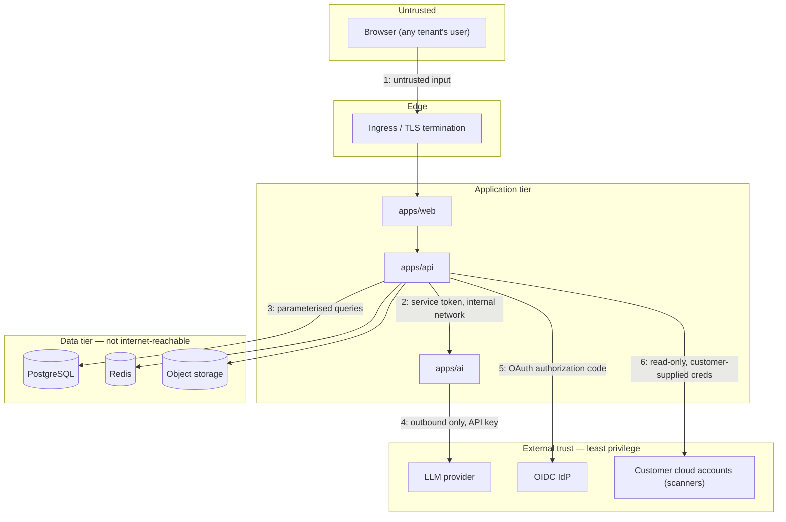

# Threat Model

STRIDE-based analysis of the Shieldwise platform's trust boundaries and the
mitigations implemented against each threat category. This is a living
document — update it when a trust boundary changes (new external
integration, new data flow).

## Trust boundaries

Numbered boundaries below map to the diagram.

## 1. Browser → Web/API (primary attack surface)

| Threat                                                  | Mitigation                                                                                                                                                                                                                                                                                                                                                  |
| ------------------------------------------------------- | ----------------------------------------------------------------------------------------------------------------------------------------------------------------------------------------------------------------------------------------------------------------------------------------------------------------------------------------------------------- |
| **Spoofing** — credential stuffing, session hijack      | Argon2id password hashing; TOTP MFA + WebAuthn passkeys; refresh-token rotation with reuse detection (a replayed/rotated token revokes the entire session family, not just itself); rate limiting on `/auth/*` (5–10 req/min per route via `@nestjs/throttler`).                                                                                            |
| **Tampering** — request forgery, parameter manipulation | Every mutating endpoint validates input via Zod schemas shared with the frontend (`ZodPipe`); tenant/role checks are server-side and cannot be bypassed by a client that omits or forges the org header — `OrgContextGuard` resolves membership from the authenticated user's actual memberships, never trusts a client-asserted org.                       |
| **Repudiation**                                         | Append-only `AuditLog` records actor, IP, user-agent, request ID, and action for every state-changing operation; the DB role cannot `UPDATE`/`DELETE` these tables even with a compromised app.                                                                                                                                                             |
| **Information disclosure**                              | Row-Level Security + ORM-layer tenant scoping (see `database.md`) — cross-tenant reads return 404, not a permission error, avoiding existence leakage. Generic "invalid email or password" on login (no user enumeration). Helmet security headers, strict CSP, HSTS preload.                                                                               |
| **Denial of service**                                   | Global rate limiting (`ThrottlerGuard`, 300 req/min default) plus tighter per-route limits on auth and AI endpoints; upload size capped (`MAX_UPLOAD_BYTES`, default 25MB); AI service calls have a 120s timeout with `ServiceUnavailableException` surfaced rather than hanging the request thread.                                                        |
| **Elevation of privilege**                              | RBAC enforced by `RolesGuard` reading the resolved organisation membership (not a client-supplied role claim); the DPIA workflow state machine additionally gates _which_ roles may perform _which_ transition, server-side, from the same table the frontend renders from (`packages/shared/src/workflow.ts`) — no separate, driftable authorization list. |

## 2. API → AI service (internal)

The AI service trusts the API completely (shared bearer token,
`AI_SERVICE_TOKEN`) and is never exposed on a public listener in the
reference deployment. Threat: a compromised API pod could invoke arbitrary
AI operations — accepted risk, since a compromised API already has full data
access; the boundary exists for blast-radius and independent-scaling
reasons, not as a security control between equally-trusted components.
Mitigation still applied: the AI service validates its own input schemas
independently (does not trust the API's validation transitively) and never
executes model output as code.

## 3–4. Data tier and LLM provider

| Threat                                    | Mitigation                                                                                                                                                                                                                                                                                                              |
| ----------------------------------------- | ----------------------------------------------------------------------------------------------------------------------------------------------------------------------------------------------------------------------------------------------------------------------------------------------------------------------- |
| **Prompt injection via DPIA free-text**   | The AI service treats retrieved guidance and user-supplied DPIA answers as data, never as instructions — the system prompt is fixed and does not concatenate user content into an instruction-bearing position. Model output for structured endpoints (`/classify`, `/improve`) is parsed as data (JSON), not executed. |
| **Data minimisation to the LLM provider** | Only the fields needed for the specific operation are sent (see `ai.service.ts` `dpiaContext()`) — not the full DPIA record, not other tenants' data, never credentials or raw evidence file contents.                                                                                                                  |
| **LLM provider outage/compromise**        | Provider abstraction (`apps/ai/app/providers/`) makes the LLM backend swappable (Anthropic/OpenAI/local) without application changes; a `local` provider option exists for deployments that cannot send data to a third-party API at all.                                                                               |
| **Secrets at rest**                       | TOTP seeds are AES-256-GCM encrypted with a per-value random nonce before storage (`common/crypto.ts`); the encryption key itself must come from a secrets manager in production (documented, not embedded).                                                                                  |

## 5. OIDC SSO

| Threat                                             | Mitigation                                                                                                                                                                                                                      |
| -------------------------------------------------- | ------------------------------------------------------------------------------------------------------------------------------------------------------------------------------------------------------------------------------- |
| **State/nonce forgery, CSRF on the auth callback** | Random `state` correlates the callback to the initiating request; `nonce` is verified against the ID token claim before provisioning/logging in a user. Both are single-use, TTL-bound, held server-side (not client-supplied). |
| **JIT-provisioning abuse**                         | A new SSO login only creates a user record after the IdP's ID token is cryptographically verified (JWKS, issuer, audience) — an attacker cannot provision an account without a valid token from the configured IdP.             |

## 6. Cloud/IaC scanners

| Threat                                 | Mitigation                                                                                                                                                                                                                                                                       |
| -------------------------------------- | -------------------------------------------------------------------------------------------------------------------------------------------------------------------------------------------------------------------------------------------------------------------------------- |
| **Credential handling**                | Connector configuration (cloud credentials) is encrypted at rest with the same AES-256-GCM scheme as TOTP seeds; decrypted only in-process for the duration of a scan.                                                                                                           |
| **Scope creep**                        | The reference AWS scanner is read-only (`ListBuckets`, `GetBucketEncryption`, `GetPublicAccessBlock`) — no write/delete permissions are ever requested; static-analysis scanners (Terraform/Docker/K8s) never execute the supplied files, only pattern-match against their text. |
| **Injection via scanned file content** | Terraform/Docker/K8s scanners are regex/string-based static analysis with no code execution path — a malicious `.tf`/`Dockerfile`/manifest cannot achieve RCE through the scanner.                                                                                               |

## Residual risks / accepted trade-offs

- **WebAuthn challenge cache is in-process** (`passkeys.service.ts`) — fine
  for a single-replica deployment; documented in code as needing a shared
  store (Redis) before horizontal scaling of the API. Tracked, not silently
  broken: a multi-replica deployment without this fix would see intermittent
  passkey failures, not a security hole (a challenge from replica A simply
  won't validate against replica B).
- **Report PDF/DOCX rendering runs in-process**, not sandboxed — accepted
  because report content is drawn from the organisation's own DPIA data
  (already-trusted, already-tenant-scoped), not arbitrary user upload.
- **No WAF/bot-management layer is bundled** — expected to be provided by
  the ingress/CDN layer in production deployments (documented in the
  deployment guide), not duplicated in-application.
